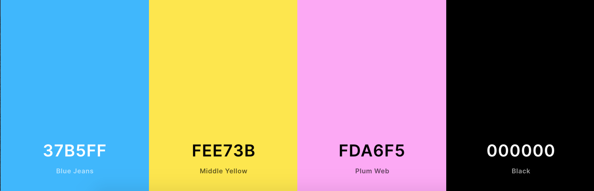

# Kids memory-game #
_How good are your memory?_

Put mockups in here !! 

## Table of contents ##

* [Introduction & project goals](#introduction--project-goals)
* [UX](#ux)      
    * [User stories](#user-stories)
    * [Development planes](#development-planes)      
    * [Design](#design)  
    * [Features](#features)  
* [Technologies](#technologies)    
* [Testing](#testing)  
* [Bugs](#bugs)  
* [Deployment](#deployment)    
* [Credit](#credit)  
* [Acknowledgements](#acknowledgements)  
---

### Introduction & Project Goals ###

What is Kids Memory-game? Kids memory-game is a fun and colorful memory-game that should get you in a good mood. It should not be to difficult. The project`s goal is to just relax and have fun! 

This is the second of four Milestone Projects that I (the developer) must complete during my Full Stack Web Development Program at The Code Institute. I´m really exited for this memory-game. My kids helped me with pictures and colors and it has been a fun family-project! 

The main requirements in this project is to make a responsive and interactive web application using primarily HTML5, CSS3 and JavaScript.

## UX ##

### User Stories ###  

As a user I want to:
* See a nice and colorful web application
* See nice pictures  
* See my score and how many moves I used 
* Have fun playing the game 
* Have the ability to contact the developer for questions

### Development planes ###  

In order to create a website that fulfilled the expectations as described above, I worked with my kids and husband throughout the process.  

### Strategy ###  
  
Divided into four categories, the website will focus on the following target audiences:  
  
  * ### Demographic: ###  
    
    * 3 - 8 year olds  
    * Particularly interested in Lego  

  * ### Psychographics: ###  
    
    * Personality & Attitudes:  
      * Love games  
      * Love having fun
      * Love learning

    * ### Values: ###  

      * Appreciates new games 
      * Positivity always wins
    
    * ### Lifestyles: ###  
     
      * It`s kids! They love life!  

### User Goals ###  
* Having fun and relax
* See images of Lego  
* Be happy  
* Grow their memory
* Ability to contact the developer directly by contact form if any questions

### Site Owner Goals ###  
* The user having fun and relax 
* The user gets in a good mood
* The users grow their memory 

### Scope ###

#### User Requirements And Expectations ####  

* Content that is visually appealing with lots of colours that kids appreciate 
* Content is well structured
* Easy to navigate the website using the menu and scroll  
* Easy to read typography
* Operational links to social media that opens in a new tab  
* Operational contact form for name, e-mail and message input  
* The web application is quick to load  

### Skelton ###  
  
Wireframes are made in [Figma](https://www.figma.com/). This is a really nice program to check out different styles and how the final result would look like on different screensizes.  

#### Design for mobile device: ####  
  
  
#### Design for tablet device: ####

#### Design for desktop device: ####

### Design ### 
The design of this web application has been created based on the colorful personality of my kids, and of course; Lego!  
  
  As the site is ment for kids in the age between 3 and 8, it was importent that the design reflected that. It`s colorful with nice pictures and easy to navigate and understand. 

  It`s one page, but the menu allows you to jump to the play section or the contact section. 

  The page starts with the name "Kids memory-game", and the menu button on a nice background photo of two Lego figures.

  Then to the "Play" section. Here the user get`s the explanation on how to play, as it says "Push the boxes and see if you can find a match". Further on the user can see their score, and how many moves they used along the way.

  It then shows "Thank you for playing" and a nice little lego ice-break image before the contact form on a Lego sandman background. 
  
  At the end we got social media icons. 

  All round, the game is looking nice and fun to play. Especially according to my kids!

* Fonts  

PUT FONTS IN HERE

  [Google Fonts](https://fonts.google.com/specimen/Open+Sans): Open Sans, sans-serif.

* Icons  

PUT ICONS IN HERE: Linkdin, insta og face

[Fontawsome](https://fontawesome.com/icons?d=gallery&p=2) provided the icons for [Facebook](https://fontawesome.com/icons/facebook-square?style=brands), [Instagram](https://fontawesome.com/icons/instagram-square?style=brands) and [Snapchat](https://fontawesome.com/icons/snapchat-square?style=brands) + [Hand point](https://fontawesome.com/icons/hand-point-right?style=solid) on founders page.

* Colours  

COLOURS IN HERE

All the colours were handpicked by the kids, (with a little intervention by the developer!) to ensure a happy and fun expression which appeals to kids.
  
  * Background: Blue Jeans, #37B5FF
  * Text: Middle Yellow, #FEE73B  
  * Buttons: Middle Yellow and Plum Web, #FDA6F5   
  * Stroke: Black, #000000  

  Color Scheme from [Coolors](https://coolors.co/);  
     

### Features ###  

The web application has a responsive layout who has pretty much the same layout on all screensizes. The thought behind that decision is that the application is for kids. The placement of the content should be easy to remember and use regardless of whether the game is played on a phone or a tablet etc.   

Features that have been implemented:  
* Memory-game
* Score and number of moves used
* Reset button
* Button change color when pushed
* Easy to navigate on all screensizes 
* Contact form with submit button. Here you can ask questions to the developer  
* Social media links 

Features that will be implemented in the future:  
* Highscore
* Background music / button on-off

### Technologies ###  
Languages  
* [HTML](https://no.wikipedia.org/wiki/HTML)  
* [CSS](https://en.wikipedia.org/wiki/CSS)
* [JS](https://no.wikipedia.org/wiki/JavaScript)  

Tools / Libraries  
* [Git](https://git-scm.com/)  
Git was used for version control by utilizing the GitPod terminal to commit to Git and push to GitHub.    
* [Bootstrap](https://getbootstrap.com/)  
Bootstrap was used to implement the responsiveness of the site, with bootstrap classes.  
* [Fontawsome](https://fontawesome.com/)  
Font Awesome was used on all pages throughout the website to import icons (e.g. social media icons) for UX purposes.  
* [Google Fonts](https://fonts.google.com/)  
Google fonts was used to import the fonts "Open Sans", sans-serif into the style.css file.  
* [Unsplash](https://unsplash.com/)  
Unsplash was used for the hero image, reviews section as well as the background wallpaper on contact page.  
* [Coolors](https://coolors.co/)  
Coolors was used to make the collorpallet.  
* [Multi Device Mockup Generator](http://techsini.com/multi-mockup/index.php)  
Multi device mockup was used in order to see the responsive design throughout the process and to generate mockup image to readme file.  
* [The W3C Markup Validation Service](https://validator.w3.org/)
Used to validate the HTML.
* [The W3C CSS Validation Service](https://jigsaw.w3.org/css-validator/)
Used to validate the CSS.
* [JSHint](https://jshint.com/)
Used to validate the JS.

### Testing ###  
The testing process for me has been through the intire building of the web application, as I wanted everything to be perfect before moving on. It was also importent to make sure that the site meets all the user stories criteria.

For HTML Validate I used [The W3C Markup Validation Service](https://validator.w3.org/), for CSS I used [The W3C CSS Validation Service](https://jigsaw.w3.org/css-validator/) and for JS I used [JSHint](https://jshint.com/)

Testing before deployment:

TESTING IN HERE!!!

Index / Home validate - ok   
  

CSS validate - ok  

Wright down all testing under the process !!!!

Here I got two errors the first time, but forgot to take a printscreen. The first one was that I got an extra div I needed to delete, and the second was "spacing not allowed", removed the extra space.  

I have tested the live site on different screens: iphone 6, 8, x and x plus - as well as tablet, desktop l and xl. I can see that it has some small alignment issues to be 100% perfekt, but I am happy with how it looks - for now. 

Testing on both Safari and Google Crome, and working fine. I think maybe it loads a little to slow on gallery page.  

Peer-code review - 

User testing feedback - 

### Bugs ###  

ALL BUGS IN HERE !!!!!

It has been a large number of issues and bugs during the development of this website, the noteworthy below:  

Footer - wouldent stay at the bottom, it was a tiny gap I needed my mentor to help me with. I was missing the class="h-100" in the html, and that combined with the class="footer mt-auto" it was pushed the final bit.  

Contact form - this I needed to remake 3 times. Learned a lot in the proccess but would have made it a fourth time if I had the time before submit. It was not acting as I wanted it to, and make it perfectly align was hard, but I think it turned out ok in the end. I used bootstrap form, jumbotrone, but landed on container. 

Toggler-icon - when trying to make the navbar darker, I removed the navbar-light. Then the toggler-icon disappeared, and the navbar-dark dit not work either as it made the text white. After several attempts and totaly messing up the css code I ended up adding it back on. I want to make it darker for better UX in the future.

Bootstrap script links - After peer code review I was told that the Bootstrap script links need to be at the bottom of the page. But when I do so, Bootstrap overrides the custom css, and the links turn blue. In the future I will figure out how to solve that and make it right. 

### Deployment ###  
  Deploying on GitHub pages  
  
  To deploy on GitHub pages from it`s GitHub respository, the following steps were taken:  
    
  1. Log into [GitHub](https://github.com/login "Link to GitHub login page") or [create an account](https://github.com/join "Link to GitHub create account page").  
  2. Locate the [GitHub Respository](https://github.com/Carhul/ms2-kids-memory-game "Link to GitHub repository").  
  3. At the top of the repository, select Settings from the menu items.  
  4. Scroll down the Settings page to the "GitHub Pages" section and push the blue "Check it out here!" text.  
  5. Under "Source" click the drop-down menu labelled "None" and select "Master".  
  6. Select "save", and the page will automatically refresh meaning that the website is now deployed.  
  7. Copy the deployed link to your live website!  

  ### Forking the Repository ###  

  By forking the GitHub Repository we make a copy of the original repository on our GitHub account to view and/or make changes without affecting the original repository by using the following steps:  
    
  1. Log into [GitHub](https://github.com/login "Link to GitHub login page") or [create an account](https://github.com/join "Link to GitHub create account page").  
  2. Locate the [GitHub Respository](https://github.com/Carhul/ms2-kids-memory-game "Link to GitHub repository").  
  3. At the top of the repository, on the right side of the page, select "Fork".  
  4. You should now have a copy of the original repository in your GitHub account.  

  ### Creating a Clone ###  

  How to run this project locally:  

   1. Install the [GitPod Browser](https://www.gitpod.io/docs/browser-extension/ "Link to Gitpod Browser extension download") Extension for Chrome.  
   2. After installation, restart the browser.  
   3. Log into [GitHub](https://github.com/login "Link to GitHub login page") or [create an account](https://github.com/join "Link to GitHub create account page").  
   4. Locate the [GitHub Respository](https://github.com/Carhul/ms2-kids-memory-game "Link to GitHub repository").  
   5. Click the green "GitPod" button in the top right corner of the repository.
  This will trigger a new gitPod workspace to be created from the code in github where you can work locally.  

  How to run this project within a local IDE, such as VSCode:  

  1. Log into [GitHub](https://github.com/login "Link to GitHub login page") or [create an account](https://github.com/join "Link to GitHub create account page").  
  2. Locate the [GitHub Respository](https://github.com/Carhul/ms2-kids-memory-game "Link to GitHub repository").  
  3. Under the repository name, click "Clone or download".  
  4. In the Clone with HTTPs section, copy the clone URL for the repository.  
  5. In your local IDE open the terminal.  
  6. Change the current working directory to the location where you want the cloned directory to be made.  
  7. Type 'git clone', and then paste the URL you copied in Step 3.  

    git clone https://github.com/USERNAME/REPOSITORY  
  
  8. Press Enter. Your local clone will be created.  

  Further reading and troubleshooting on cloning a repository from GitHub [here](https://docs.github.com/en/free-pro-team@latest/github/creating-cloning-and-archiving-repositories/cloning-a-repository "Link to GitHub troubleshooting").

### Credit ###  
Content and text used in this website is written by me in collaboration with my kids and husband, Leon, Mila and Thomas.  
#### Setup and text in README.md ####  
I have used the same inspiration as I did in MS1 for the readme file. They where awsome then and still are! So thank you to:

* [byllsa](https://github.com/byIlsa/Aloy-from-outcast-to-heroine/blob/master/README.md) and [Miranda](https://github.com/mkthewlis/Milestone-Project-1) for clear, neat and inspiring readme files.
* [Pumpkin](https://www.pumpkinwebdesign.com/web-design-manchester/top-user-expectations-for-web-design-in-2021/) for inspiration on _user requirements and expectations_ section.  
* [rebeccatraceyt](https://github.com/rebeccatraceyt) for an exceptional readme file, and and especially the deployment section - who is a copy/paste on Forking the respository and Creating a Clone.   
  
#### Images ####  

IMAGES IN HERE !!!!

About page - images is provided by [Unsplash](https://unsplash.com/). At the top from [Fred](https://unsplash.com/photos/0yqa0rMCsYk), and reviews from [Ivana](https://unsplash.com/photos/_7LbC5J-jw4), [Atikh](https://unsplash.com/photos/_KaMTEmJnxY) and [Amir](https://unsplash.com/photos/BFxyTaw3PsM).  
  
  Contact page - background image by [Pradnyal](https://unsplash.com/photos/1MqDCpA-2hU).  
    
### Acknowledgements ###

* My mentor, Seun, for her once again indispensable guidance, motivation and magic trics along the way. She really inspire me with here knowledge, humor and good mood! 
* My kids, for helping me with the colours and pictures for this application.  
* My husband for the patience in this, and also input. 
* Friends and colleagues for their feedback along the way.