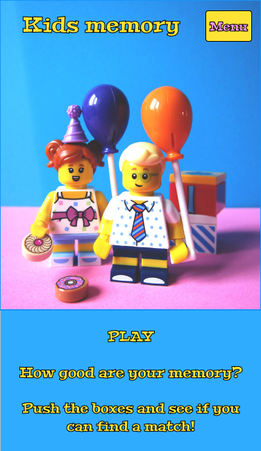
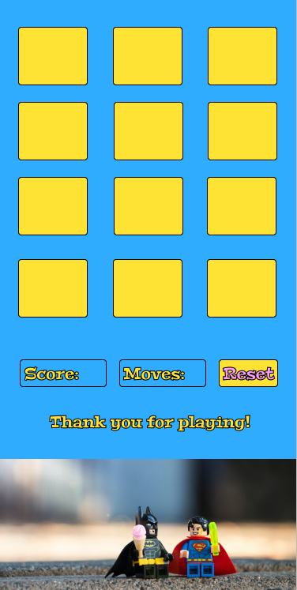
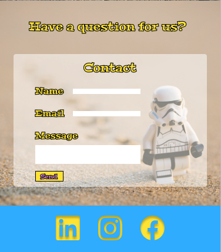
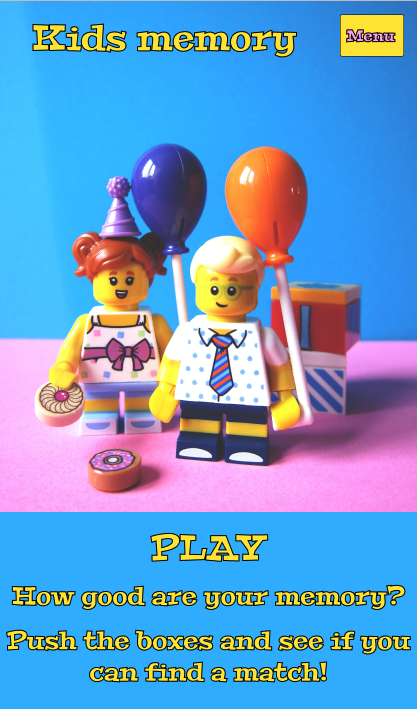
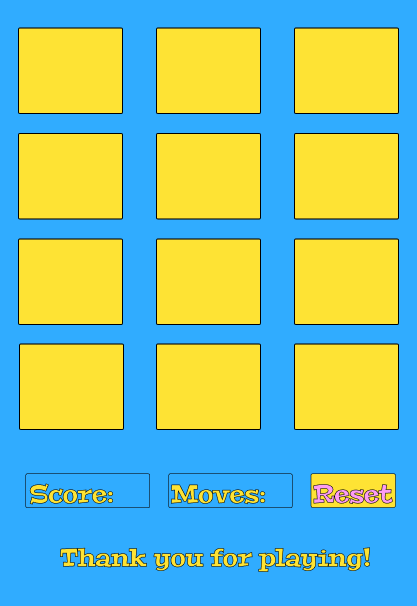
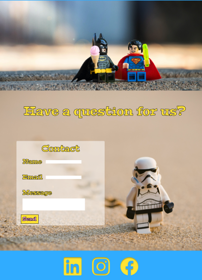
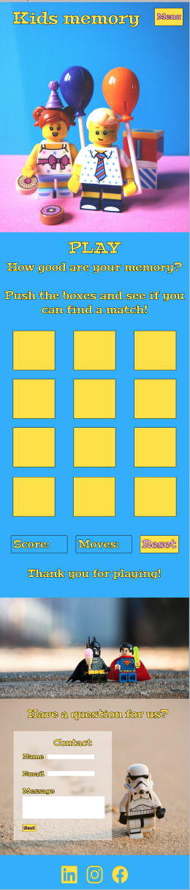

# Kids memory-game #
_How good are your memory?_  

[View the live site here](https://carhul.github.io/ms2-kids-memory-game/).

 

## Table of contents ##

* [Introduction & project goals](#introduction--project-goals)
* [UX](#ux)      
    * [User stories](#user-stories)
    * [Development planes](#development-planes)      
    * [Design](#design)
    * [Changes from wireframes to published application](#Changes-from-wireframes-to-published-application)
    * [Features](#features)  
* [Technologies](#technologies)    
* [Testing](#testing)  
* [Bugs](#bugs)  
* [Deployment](#deployment)    
* [Credit](#credit)  
* [Acknowledgements](#acknowledgements)  
---

### Introduction & Project Goals ###

What is Kids Memory-game? Kids memory-game is a fun and colorful memory-game that should get you in a good mood. It should not be to difficult. The project`s goal is to just relax and have fun! 

This is the second of four Milestone Projects that I (the developer) must complete during my Full Stack Web Development Program at The Code Institute. I´m really exited for this memory-game. My kids helped me with pictures and colors and it has been a fun family-project! 

The main requirements in this project is to make a responsive and interactive web application using primarily HTML5, CSS3 and JavaScript.

## UX ##

### User Stories ###  

As a user I want to:
* See a nice and colorful web application
* See nice pictures of lego  
* See my score and how many moves I used 
* Have fun playing the game 
* Have the ability to contact the developer for questions

### Development planes ###  

In order to create a website that fulfilled the expectations as described above, I worked with my kids and husband throughout the process.  

### Strategy ###  
  
Divided into three categories, the website will focus on the following target audiences:  
  
  * ### Demographic: ###  
    
    * 3 - 8 year olds  
    * Particularly interested in Lego  

  * ### Psychographics: ###  
    
    * Personality & Attitudes:  
      * Love games  
      * Love having fun
      * Love learning
    
    * ### Lifestyles: ###  
     
      * It`s kids! They love life!  

### User Goals ###  
* Having fun and relax
* See images of Lego  
* Be happy  
* Grow their memory
* Ability to contact the developer directly by contact form if any questions

### Site Owner Goals ###  
* The user having fun and relax 
* The user gets in a good mood
* The users grow their memory  
* The ability to receive and answer questions or feedback from the user

### Scope ###

#### User Requirements And Expectations ####  

* Content that is visually appealing with lots of colours that kids appreciate 
* Content is well structured
* Easy to navigate the website using the "Play" and "Contact" button and scroll  
* Easy to understand how to play the game and reset to play again
* Easy to read typography
* Operational link to GitHub that opens in a new tab  
* Operational contact form for name, e-mail and message input   

### Skeleton ###  
  
Wireframes are made in [Figma](https://www.figma.com/). This is a really nice program to check out different styles and how the final result would look like on different screensizes. This is used instead of Balsamiq on recomendation from my mentor.

#### Design for mobile device: ####  
  
  
  
  
#### Design for tablet device: ####
  
  
  

#### Design for desktop device: ####

### Design ### 
The design of this web application has been created based on the colorful personality of my kids, and of course; Lego!  
  
  As the site is ment for kids in the age between 3 and 8, it was importent that the design reflected that. It`s colorful with nice pictures and easy to navigate and understand. 

  It`s one page, but the "Play" and "Contact" buttons allows you to jump to the section you want. 

  The page starts with the name "Kids memory-game", and the play and contact buttons on a nice background photo of two Lego figures.

  "Play" section. Here the user get`s the explanation on how to play, as it says "Push the boxes and see if you can find a match". Further on the user can see their score, and how many moves they used along the way.
  When all pairs are found, an alert of "Congratulations! You found all the pairs!" will show up.  The user can then push the reset button to play again, or scroll further down. 

  It then shows "It's a great day for gaming!" and a nice little lego ice-break image before the contact form.  

  The contact form have input fields for "Name", "Emailaddress" and "Message". All three needs to be filled before submit. The placeholder text written "by batman" is fun for the kids, and tries to convey that there are no questions or feedback that is stupid.  

  Then you got the submit, clear form and play again buttons before the GitHub icon in the footer who takes the user to the developers GitHub page.

  All round, the game is looking welcoming, delicate and fun to play. Especially according to my kids!

* Fonts  
  
  [Google Fonts](https://fonts.google.com/specimen/Peralta#standard-styles): Peralta (fallback Roboto, sans-serif).  
  This font is picked out by my youngest, she said it had a "fun and playful look", I agree.

* Icons  

  [Fontawsome](https://fontawesome.com/icons?d=gallery&p=2) provided the icon for [Github](https://fontawesome.com/v5.15/icons/github?style=brands).

* Colours  

All the colours were handpicked by the kids, (with a little intervention by the developer!) to ensure a happy and fun expression which appeals to kids.
  
  * Background: Blue Jeans, #37B5FF
  * Text: Middle Yellow, #FEE73B  
  * Buttons: Middle Yellow and Plum Web, #FDA6F5   

  Color Scheme from [Coolors](https://coolors.co/)  
     

### Changes from wireframes to published application ###  
The menu-button was only supposed to contain play and contact. As I started to work with the application I made it become two buttons for each instead, as the dropdown seemed redundant. I also chose to place them underneath the Kids Memory text, because two buttons was to much on smaller screen and I wanted it to look as alike as possible on all screensizes as this is an application for kids. 

Stroke: Black #000, on text, and border on buttons, was removed as it looked more UX-friendly.  

Reset-button was originally on the same line as Score and Moves. I moved it to be underneath as it looked nicer.  After middle call with mentor she recommended me to make the content more compact. Therefore, the score, moves and reset are stacked on top of each other.  

Background image on contact form was to much. When I started to work with it I thought it was distracting and decided to not include it to get a more "clean" look.   

On contact form, I decided to add a clear form button, so that the user can clear the form if they want to start over before submitting. I also added a play again button so the user could jump right back in to the game.  

In the wireframes it first was intended to be Linkedin, snapchat and instagram, but an icon-link to developers GitHub page rather than links to "blank" social media was determined as a better idea.  

Text after the Memory Game board said "Thank you for playing!" But after the final call with mentor, I was advised to make it disappear and only show after played. But as I already have a text that shows when played, I changed the text to be "It`s a great day for gaming!".

### Features ###  

The web application has a responsive layout who has pretty much the same layout on all screensizes. The thought behind that decision is that the application is for kids. The placement of the content should be easy to remember and use, regardless of whether the game is played on a phone or a tablet etc.   

Features that have been implemented:  
* Memory-game  
  Let`s the user play a memory game with twelve cards, and by flipping them try to find all matching pairs.  

* Play and contact button  
  Takes the user to the respective section they want.  

* Score and moves  
  Show the user in real-time how many pairs (score), and how many moves used.  

* Reset button  
  Let`s the user reset the game to play again.  

* Operational contact form  
  Input for name, e-mail and message.  

* Submit button  
  Let`s the user submit the contact form after filling out all three input fields. The submit button also clear the form automatic after it is pushed.     

* Clear form button  
  Let`s the user clear the form if he or she writes something wrong and want to start over.  

* Play again button  
  Let`s the user go straight up to the play section to play again without scrolling.  

* Easy to navigate on all screensizes  
  By making the layout look the same by adding responsivnes, it is easy for the user to navigate on all screensizes.  

* GitHub link  
  GitHub link takes the user to the developers GitHub page.  

* Custom 404 page  
* Favicon  

Features that will be implemented in the future:  
* Highscore
* Increased difficulty
* Background music / button on-off
* Sound when boxes in Memory Game are pushed  
* Styled alert messages with lego background

### Technologies ###  
Languages  
* [HTML](https://no.wikipedia.org/wiki/HTML)  
* [CSS](https://en.wikipedia.org/wiki/CSS)
* [JS](https://no.wikipedia.org/wiki/JavaScript)  

Tools / Libraries  
* [Git](https://git-scm.com/)  
Git was used for version control by utilizing the GitPod terminal to commit to Git and push to GitHub.    
* [Bootstrap](https://getbootstrap.com/)  
Bootstrap was used to implement the responsiveness of the site.
* [Fontawsome](https://fontawesome.com/)  
Font Awesome was used to import the GitHub icon for UX purposes.  
* [Google Fonts](https://fonts.google.com/)  
Google fonts was used to import the fonts Peralta, Roboto and Sans-serif into the style.css file.  
* [Unsplash](https://unsplash.com/)  
Unsplash was used for all the images on the web application.
* [Coolors](https://coolors.co/)  
Coolors was used to make the colorpalett.  
* [Ezgif](https://ezgif.com/resize)  
Ezgif was used to resize the images in the Memory Game to avoid stretch.
* [Multi Device Mockup Generator](http://techsini.com/multi-mockup/index.php)  
Multi device mockup was used in order to see the responsive design throughout the process and to generate mockup image at the beginning of the README.md and TESTING.md files.  
* [The W3C Markup Validation Service](https://validator.w3.org/)  
Used to validate the HTML.
* [The W3C CSS Validation Service](https://jigsaw.w3.org/css-validator/)  
Used to validate the CSS.
* [JSHint](https://jshint.com/)  
Used to validate the JS.  
* [Lighthouse](https://developers.google.com/web/tools/lighthouse)  
Used to test the performance on phone and desktop.  
* [Free Formatter](https://www.freeformatter.com/)  
Used to beautify both the HTML, CSS and JS.   

### Testing ###  
The whole test process can be seen in the [TESTING.md](TESTING.md) file.

### Bugs ###   
All larger bugs are stored in the [Testing.md](TESTING.md) file.

### Deployment ###  
  Deploying on GitHub pages  
  
  To deploy on GitHub pages from it`s GitHub respository, the following steps were taken:  
    
  1. Log into [GitHub](https://github.com/login "Link to GitHub login page") or [create an account](https://github.com/join "Link to GitHub create account page").  
  2. Locate the [GitHub Respository](https://github.com/Carhul/ms2-kids-memory-game "Link to GitHub repository").  
  3. At the top of the repository, select Settings from the menu items.  
  4. Scroll down the Settings page to the "GitHub Pages" section and push the blue "Check it out here!" text.  
  5. Under "Source" click the drop-down menu labelled "None" and select "Master".  
  6. Select "save", and the page will automatically refresh meaning that the website is now deployed.  
  7. Copy the deployed link to your live website!  

  ### Forking the Repository ###  

  By forking the GitHub Repository we make a copy of the original repository on our GitHub account to view and/or make changes without affecting the original repository by using the following steps:  
    
  1. Log into [GitHub](https://github.com/login "Link to GitHub login page") or [create an account](https://github.com/join "Link to GitHub create account page").  
  2. Locate the [GitHub Respository](https://github.com/Carhul/ms2-kids-memory-game "Link to GitHub repository").  
  3. At the top of the repository, on the right side of the page, select "Fork".  
  4. You should now have a copy of the original repository in your GitHub account.  

  ### Creating a Clone ###  

  How to run this project locally:  

   1. Install the [GitPod Browser](https://www.gitpod.io/docs/browser-extension/ "Link to Gitpod Browser extension download") Extension for Chrome.  
   2. After installation, restart the browser.  
   3. Log into [GitHub](https://github.com/login "Link to GitHub login page") or [create an account](https://github.com/join "Link to GitHub create account page").  
   4. Locate the [GitHub Respository](https://github.com/Carhul/ms2-kids-memory-game "Link to GitHub repository").  
   5. Click the green "GitPod" button in the top right corner of the repository.
  This will trigger a new gitPod workspace to be created from the code in github where you can work locally.  

  How to run this project within a local IDE, such as VSCode:  

  1. Log into [GitHub](https://github.com/login "Link to GitHub login page") or [create an account](https://github.com/join "Link to GitHub create account page").  
  2. Locate the [GitHub Respository](https://github.com/Carhul/ms2-kids-memory-game "Link to GitHub repository").  
  3. Under the repository name, click "Clone or download".  
  4. In the Clone with HTTPs section, copy the clone URL for the repository.  
  5. In your local IDE open the terminal.  
  6. Change the current working directory to the location where you want the cloned directory to be made.  
  7. Type 'git clone', and then paste the URL you copied in Step 3.  

    git clone https://github.com/USERNAME/REPOSITORY  
  
  8. Press Enter. Your local clone will be created.  

  Further reading and troubleshooting on cloning a repository from GitHub [here](https://docs.github.com/en/free-pro-team@latest/github/creating-cloning-and-archiving-repositories/cloning-a-repository "Link to GitHub troubleshooting").

#### About Git Commit ####  

As I was already half way on this project when received feedback from my MS1, I have done the git commit wrong until this point. From late evening on June 22, the git commit should be as asked in feedback. 

### Credit ###  

Content and text used in this website is written by me in collaboration with my kids and husband, Leon (8 years old), Mila(6 years old) and Thomas.  

#### Setup and text in README.md ####  

I have used my own [README.md](https://github.com/Carhul/Wingmans-Brygge/blob/master/README.md) file from MS1 as inspiration for this README.md.  
  
#### Images ####  

Background images:  

[Hello I´m Nik - Lego figures with balloons](https://unsplash.com/@helloimnik?utm_source=unsplash&utm_medium=referral&utm_content=creditCopyText")  
[Yulia Matvienko - Lego figures on Icecream-break](https://unsplash.com/@yuliamatvienko?utm_source=unsplash&utm_medium=referral&utm_content=creditCopyText)  

Memorybox images:

[Daniel Cheung - Lego figures crossing the road](https://unsplash.com/s/photos/lego?utm_source=unsplash&utm_medium=referral&utm_content=creditCopyText)  
  [Ben - Lego figures in living rom](https://unsplash.com/s/photos/lego?utm_source=unsplash&utm_medium=referral&utm_content=creditCopyText">Unsplash)  
  [Zakaria Ahada - Legoman on the beach](https://unsplash.com/s/photos/lego?utm_source=unsplash&utm_medium=referral&utm_content=creditCopyText)  
  [Daniel Cheung - Legoman painting](https://unsplash.com/s/photos/lego?utm_source=unsplash&utm_medium=referral&utm_content=creditCopyText)  
  [Inês Pimentel - Lego unicorn](https://unsplash.com/s/photos/lego?utm_source=unsplash&utm_medium=referral&utm_content=creditCopyText)  
  [Hello I'm Nik - Lego chicken](https://unsplash.com/s/photos/lego?utm_source=unsplash&utm_medium=referral&utm_content=creditCopyText)  

Memory Game:  

* [Ania Kubow](https://www.youtube.com/watch?v=tjyDOHzKN0w) on youtube.  
* [Michelle3334](https://github.com/Michelle3334) / freaky_memory on GitHub.
* [dandavies23](https://github.com/dandavies23/smoothie-moves/blob/master/game.html) / smoothie-moves on GitHub.  
* [Sean Young_lead](https://app.slack.com/client/T0L30B202/CGWQJQKC5/thread/CGWQJQKC5-1624870968.428100) on Slack, for helping with bad randomized cardArray.
    
### Acknowledgements ###

* My kids, for helping me with the colours and pictures for this application. 
* My mentor, Seun, for her once again motivation and guidance. She really inspires me with here knowledge, humor and good mood! 
* My husband for the patience in this, and also input. 
* Friends and colleagues for their feedback along the way.