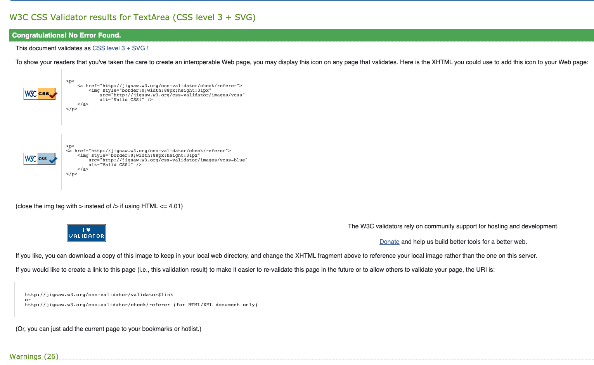

# Testing #    

[README.md file](README.md)  
[View live project]()  

---  

## Table of contents ##  

1. [Testing User Stories](#Testing-User-Stories)  
2. [Manual Testing](#Manual-Testing)  
3. [Automated Testing](#Automated-Testing)  
4. [User Testing](#User-Testing)  

  

---

### Testing User Stories ###  

1. As a user I want to see a nice and colourful web application.  
    
    When enter the application, the user meets a nice yellow Kids Memory header and buttons in pink and blue on a yellow background. This is stacked on top of a colourful background image of two lego figures holding balloons. The same color palette follows throughout the application.  
2. As a user I want to see nice pictures.  
  
    We have the entering background image, twelve images when playing the Kids Memory game, and the cool icecream break image before the contact section.  
3.  As a user I want to see my score and how many moves I used.  
    
    The score and moves counter works as it should, and keeps track until finish game and reset is pushed.  
4.  As a user I want to have fun playing the game.  
    
    The game is absolutely fun for the Kids!  
5.  As a user I want to have the ability to contact the developer for questions.  
    
    The contact form looks nice, with possibility to contact after input and submit, clear form or push Play again! 

    

### Manual Testing ###  

* Buttons:  
    * Play and play again button is both working and takes the user to the play section.  
    * Contact button is working, takes the user to the contact section.  
    * Reset button is working. Resets the game.  
    * Submit button did not work. It should send an email to the devloper and alert the user on screen, also send an email to the user with confirmation.  
      
    After use of slack and watching the CI learning material again I removed the POST method. The submit button now function.  
      
    Email to user:  
      
    Email to developer:  
      
    * Clear Form button should clear the form if the user wants to send another message or have written something wrong and wants to start over (it does not clear after submit as it should stay as a reminder of the message sent). When pushed it clears.

* Kids Memory game

  The game should just turn two image boxes, and if a match - stay open. If not a match turn back to yellow. It should also count both score and moves. This works:  
    
  When all matches are found the win-message should appear and it does:  
    

* GitHub link on footer  
Opens in a new tab and takes the user to the developers GitHub page as it should.  

* Responsiveness  
Landing-page with header and buttons for Play and Contact:  
  
  
  
  
  

Play section:  

  

Contact section:  

### Automated Testing ###  

For HTML Validate I used [The W3C Markup Validation Service](https://validator.w3.org/), for CSS, [The W3C CSS Validation Service](https://jigsaw.w3.org/css-validator/) and for JS I used [JSHint](https://jshint.com/)

Testing before deployment:  

Index.html first validate had fifteen warnings / error
  
After trying to remove them I got this on second attempt:  
  
Then after understanding how to correctly comment in the HTML I got this:  
.  
The issue on line 32, 33 and 99 is a challenge, as I put it the other way around in the first place, but then got a bug. Solved the bug by switch place on button and a href. I cleaned up the last error by removing aria-describedby="emailHelp", as this is something I first thought to include but later removed but forgot to remove all of it:  
  

MORE TESTING HERE ON HTML  

Style.CSS first validate had no error but twenty-six warnings:  

  
The border colour and the background colour are the same as I thought I could see some white when not applied, but will remove this again. Second CSS validate:  
  
Regarding the two final warnings I found the following statement at [StackOverflow](https://stackoverflow.com/questions/25946111/importing-css-is-ending-up-with-an-error): "You're just trying to validate your CSS file using the W3C validator, and it's letting you know that it's not going to validate the imported style sheet (Google's). It's not an error, just some information for you". So I don`t do anything more about them for now.  

Index.js validation had no error, but thirty-three warnings:  

### User Testing ###